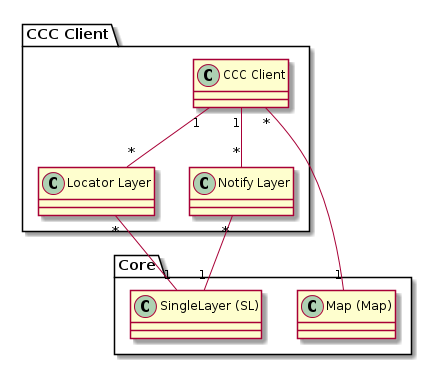

# CCC

## Klasse CCC Client

Repräsentiert die Anbindung einer Fachapplikation via CCC-Schnittstelle.

### Attributbeschreibung

|Name|Typ|Z|Beschreibung|
|---|---|---|---|
|key|String|Ja|Sprechender Key dieser Integration, welche als appIntegration URL-Parameter verwendet wird.|
|title|String|Ja|Titel, welcher für das "verheiratete" WGC-Fenster angezeigt wird.|
|remarks|String|Nein|Interne Bemerkungen des AGI zu dieser Anbindung.|

## Klasse Locator Layer

Ebene, welche im Priority-Locator für das Heranzoomen vor dem Editieren genutzt wird. 
Beispiel mit zwei konfigurierten Ebenen:
1. Zoom auf ein Grundstück
2. Zoom auf eine Gemeinde

### Attributbeschreibung

|Name|Typ|Z|Beschreibung|
|---|---|---|---|
|sort_index|Integer|Ja|Sortierungsindex. Bestimmt, in welcher Priorität die Ebene für das Lokalisieren verwendet wird.|
|filter|String|Ja|Filter, mit welchem mittels Dataservice die zutreffenden Geometrien für das Lokalisieren abgefragt werden.|

### Konstraints

UK über filter und die beiden FK's.

## Klasse Notify Layer

Ebene, für die ein Rückaufruf GIS --> Fachapplikation über das Feature-Info Fenster konfiguriert ist.

### Attributbeschreibung

|Name|Typ|Z|Beschreibung|
|---|---|---|---|
|title|String|Ja|Bezeichnung, mit welcher der Rückaufruf im Feature-Info Fenster angezeigt wird.|
|attributeMap|Json|Ja|Mapping des im CCC-Protokoll verwendeten Attributnamens auf den Attributnamen des SingleLayer. Strukturierung siehe Doku des config.json für CCC.|

### Konstraints

UK über die FK's.

