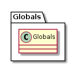

# Globals

Tabellen zur Verwaltung der globalen Variablen.

 

## Klasse Globals

Enthält die globalen Variablen in der Form einer Key / Value Liste.

### Attributbeschreibung

|Name|Typ|Z|Beschreibung|
|---|---|---|---|
|key|String(100)|j|Key, unter welchem die Variable gefunden wird.|
|value|String|j|Value als Json-Fragment (Objekt, Array, Einzelwert).|
|remarks|String(512)|n|Interne Bemerkungen zur Variable.|

### Konstraints

* UK über key

### Beispiele

|key|value|
|---|---|
|wgc.scales|[10000, 20000, 40000, 80000, 160000]|
|wgc.bbox_ktso|"bounds": [2590000, 1210000, 2650000, 1270000]|
|wgc.hintergrundkarte_sw|{ "hintergrundkarte_sw", "title": "Karte SW", "type": "wmts", "url": "https://geo.so.ch/api/wmts/1.0.0/ch.so.agi.hintergrundkarte_sw/default/{TileMatrixSet}/{TileMatrix}/{TileRow}/{TileCol}.png", "tileMatrixSet": "2056", "tileMatrixPrefix": "", "thumbnail": "img/custommapthumbs/e53e11fc-0a48-49e3-941b-9350c9eaebad.png", "projection": "EPSG:2056", "originX": 2420000, "originY": 1350000, }|

### Bemerkungen

Da auch Json-Fragmente konfiguriert sein können, wird bei der Validierung vor dem Speichern der Wert:
* "As is" Json-Validiert
* Mit umschliessenden geschweiften Klammern validiert: { Wert }

Eine der beiden Formen muss valide sei, damit gespeichert werden kann. 

Wie Beispiel "wgc.hintergrundkarte_sw" zeigt, können auch grössere Json-Blöcke "als Ganzes" konfiguriert werden.  